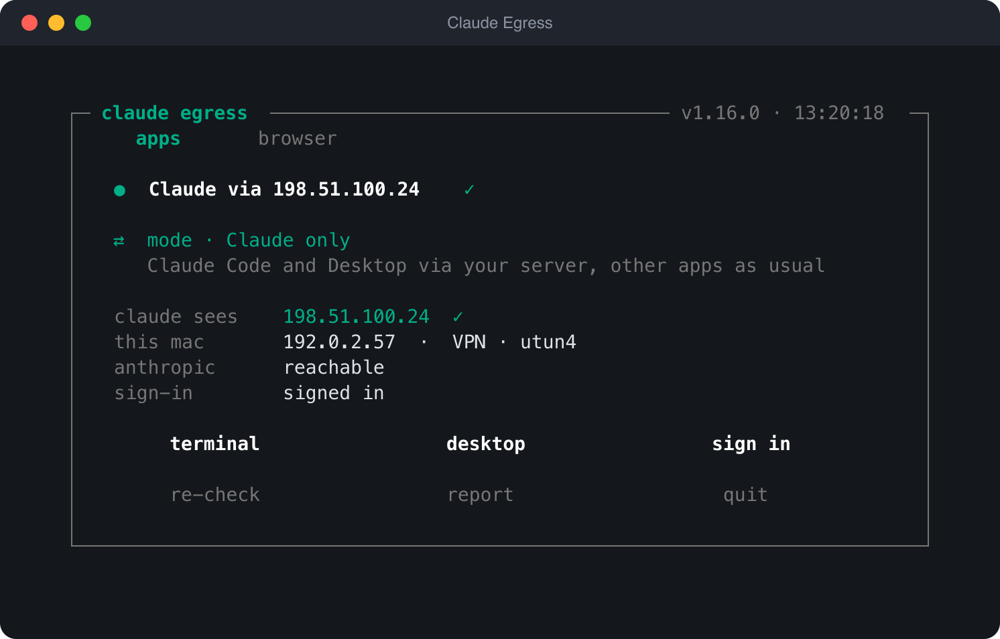
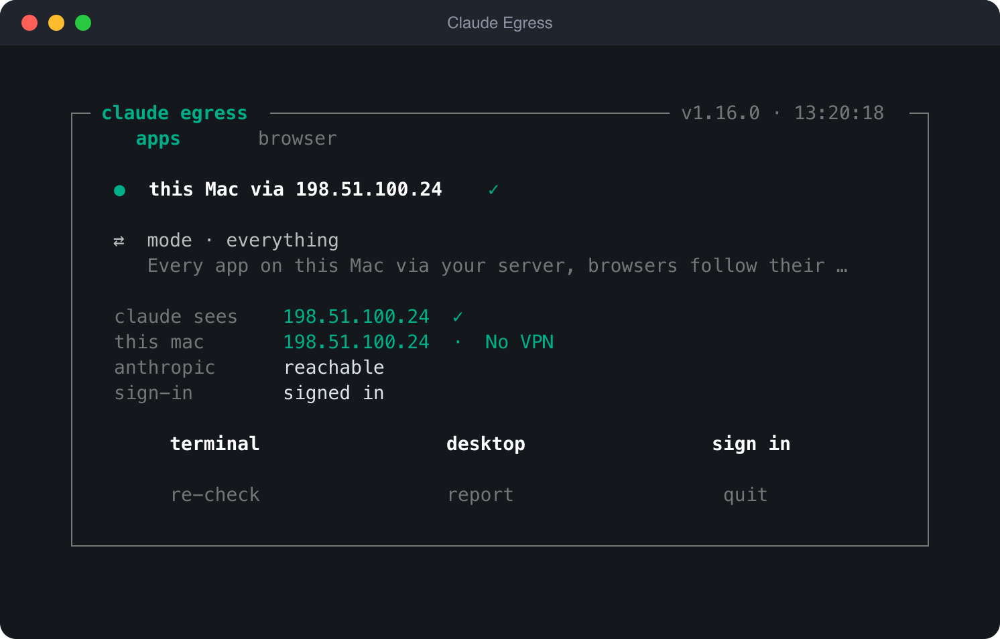
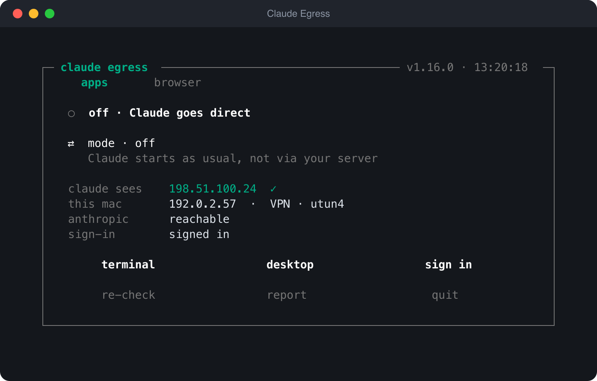
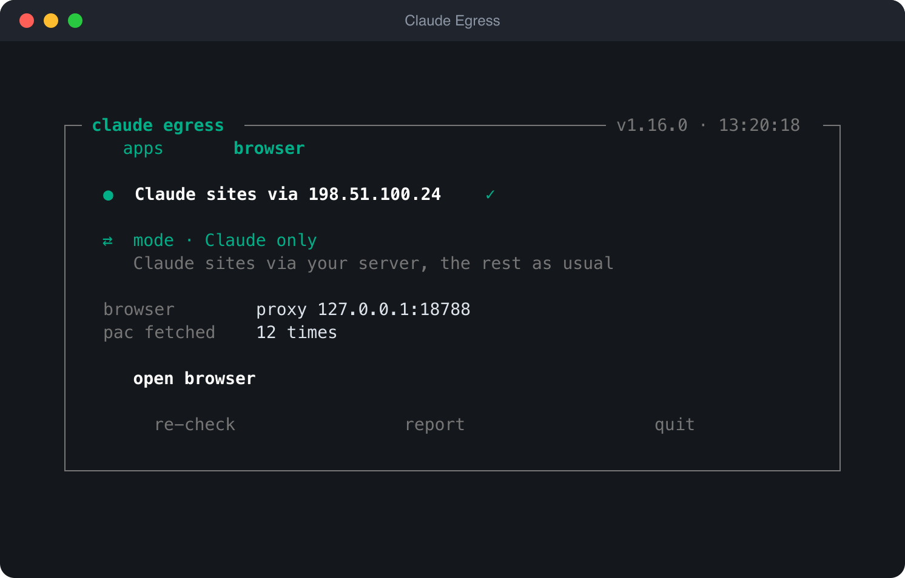
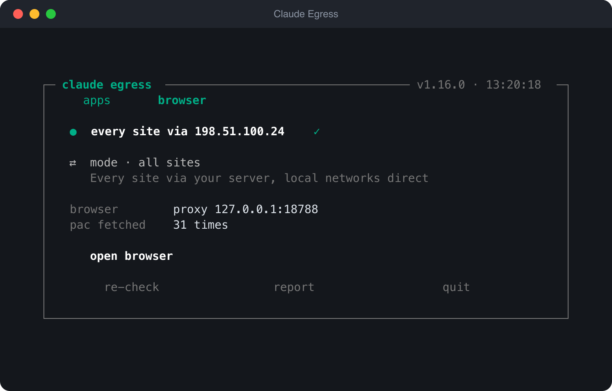
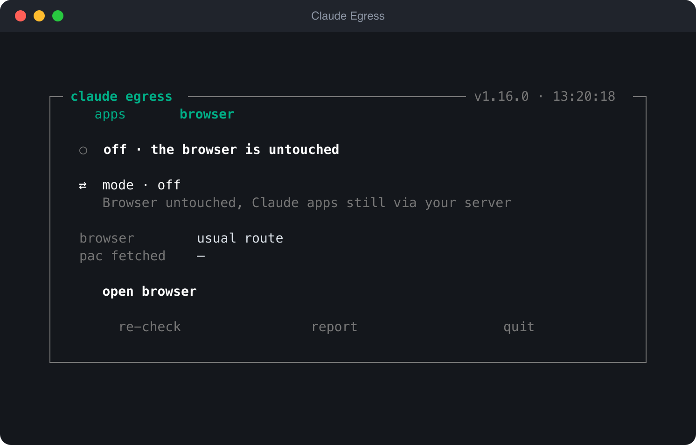
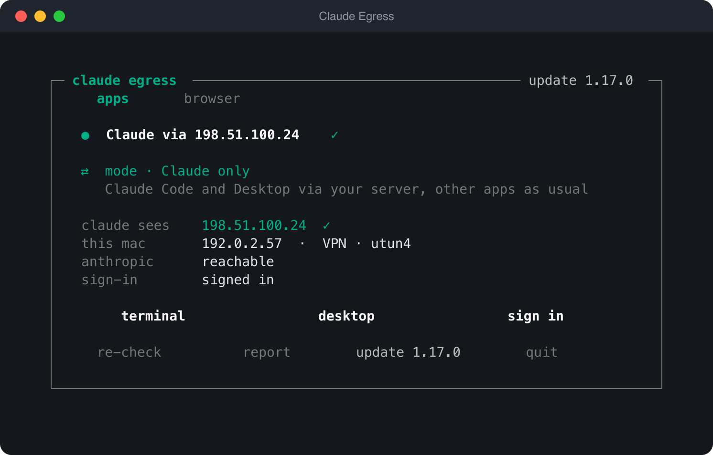
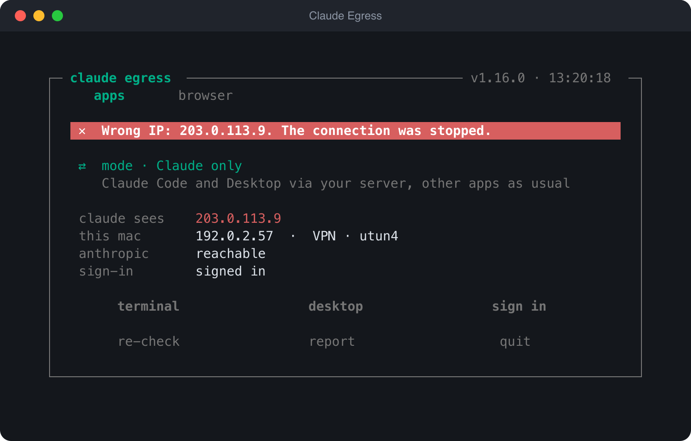

<h1 align="center">Claude Egress</h1>

One fixed outbound address for Claude, or for your whole Mac. Through a server you own or a proxy you bought, with your VPN and everything else left alone unless you say otherwise.

  

## What you need

- macOS 13 or later.
- One way out, of your own:
  - an Ubuntu VPS with a public IPv4 and SSH, which the app sets up for you, or
  - an HTTP or SOCKS5 proxy: address, port, login and password.
- Your own Claude account.

Nothing is bundled. The app ships with no addresses and no passwords: on first run it asks for yours.

## Install

1. Download **`claude-egress-<version>-macos.dmg`** from the [latest release](../../releases/latest).
2. Open it and drag **Claude Egress** onto Applications.
3. Open it from Applications.

The app is signed with a Developer ID and notarised by Apple, so it opens straight away. It updates itself afterwards, with your say-so. Opening it again while it runs brings the running session into the new window; the connection stays up.

The release also carries `…-macos.zip`, which is what the built-in updater downloads. Either one installs the same app.

## First run

It closes any running Claude, then asks a few questions.

| Question | What to answer |
| --- | --- |
| Clear Claude data? | **No**, unless you want a clean slate. A backup is saved either way. Asked on the first run only. |
| Server | **Add a server**, then either **Set up a server over SSH** (your VPS address, user and port; OpenSSH asks for the password itself and the app never stores it) or **Use an HTTP or SOCKS5 proxy** (address, port, login, password). For a proxy the app shows the address Claude will be seen from and asks you to confirm it. |
| Project folder | Where Claude Code should open. |
| Allow a system PAC | Needed for the browser tab. macOS asks for your administrator password in its own dialog. |

Then press **sign in**, finish signing in through the browser that opens, and press **terminal**.

Adding a server that is already set up costs nothing: the app checks it is healthy and reuses it, without reinstalling or restarting anything.

## Two tabs

The window has two tabs, **apps** and **browser**; Tab or a click switches between them. Each tab has its own status line, green when the address it promises is the address the world sees, and its own three-way mode switch.

### apps

<table>
<tr>
<td align="center" width="33%"> <b>Claude only</b> default</td>
<td align="center" width="33%"> <b>everything</b> the whole Mac</td>
<td align="center" width="33%"> <b>off</b> Claude as usual</td>
</tr>
</table>

**Claude only** sends Claude Code and Claude Desktop through your way out and leaves every other app on its usual route, VPN included. **everything** sends every app on the Mac through it, so the Mac behaves as if it sat behind your server: a TUN interface hands each connection to the same local relay Claude uses. Your local network and the server itself stay direct, browsers follow their own tab, UDP is refused so apps fall back to TCP, and DNS goes out over HTTPS through the same channel. Turning it on asks for your administrator password; turning it off does not, and it ends with the session. It will not start while a VPN is on, because two system-wide routes break each other. **off** starts Claude exactly as it would without this app.

### browser

<table>
<tr>
<td align="center" width="33%"> <b>Claude only</b> default</td>
<td align="center" width="33%"> <b>all sites</b> everything but local</td>
<td align="center" width="33%"> <b>off</b> browser untouched</td>
</tr>
</table>

In **Claude only** the published Claude and Anthropic domains go through your way out and nothing else does. **all sites** sends the whole browser through it, except `localhost`, `*.local` and private networks, so the sign-in callback and your intranet still work, and your server sees where every tab goes. **off** puts your previous browser settings back. The tab also counts how often browsers have fetched the routing file; zero means an extension or a policy is overriding it, and **open browser** starts a Chrome profile that cannot be overridden.

### Common setups

| You want | apps | browser | Your VPN |
| --- | --- | --- | --- |
| Everything through your way out, instead of a VPN | everything | all sites | off |
| Claude through your way out, everything else through the VPN | Claude only | Claude only | on |
| Claude through your way out, everything else direct | Claude only | Claude only | off |
| The app out of the picture | off | off | either |

Switch **apps** away from **everything** before turning a VPN on.

## Updates

The version sits in the header. The app checks at startup and whenever you press **re-check**, and tells you when there is nothing new. An update is verified against its published SHA256 and its contents are checked before anything is replaced. Only the window is swapped: the relay, the browser route and Claude keep running throughout.

## When something is wrong

The status line fills red. A wrong address stops the relay and closes Claude rather than let it leave from the wrong IP; so does losing the route twice in a row. Click the line for the full message. **report** writes a zip to your Desktop with the version, the environment and the tail of the logs, with your password, server address and user name removed.

Keep the window open: the connection lives as long as the session does. A closed or lost window is brought back by opening the app again.

## Honest limits

- This is a router, not a kill switch. Quitting the app, or an app that ignores both the proxy settings and the TUN, sends traffic on its usual route.
- An HTTP proxy carries your proxy login unencrypted; Claude's own traffic stays inside HTTPS, so the proxy sees which sites you reach, not what you send. A VPS set up by the app uses a pinned TLS channel instead.
- **everything** carries TCP only: calls, games and other UDP traffic do not get through it.
- A fixed address does not guarantee that a service is available to you or that an account is in good standing.
- Windows is written but has not been piloted on real hardware, and has no **everything** mode.

## Licence

MIT. See [LICENSE](LICENSE) and the [changelog](CHANGELOG.md).
